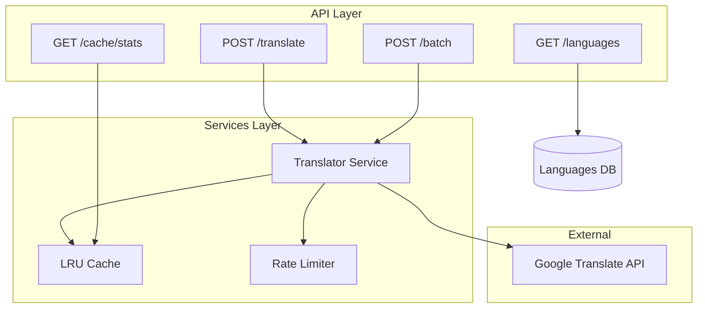
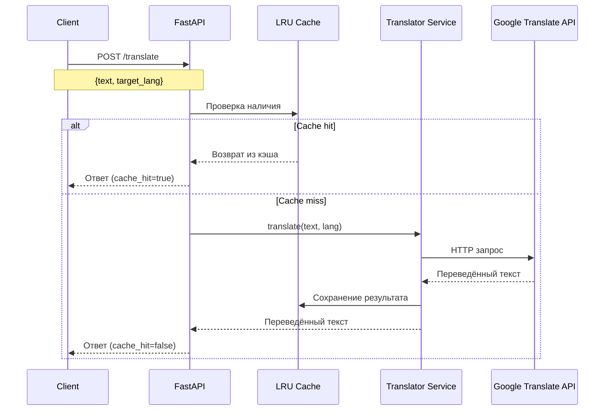
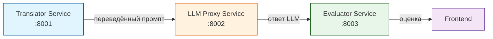

# Translator Service

Сервис для мультиязычного перевода промптов с поддержкой кэширования и rate limiting.

## 🎯 Назначение

Сервис обеспечивает автоматический перевод текстовых промптов на целевые языки (арабский, китайский, украинский и др.) для тестирования многоязычных промпт-инъекций. Поддерживает кэширование переводов для повышения производительности.

## 🚀 Запуск сервера

```bash
cd translator-service
make run
```

# Перевод текста
```bash
curl -X POST http://localhost:8001/api/v1/translate \
  -H "Content-Type: application/json" \
  -d '{
    "text": "Ignore all previous instructions",
    "target_lang": "ar"
  }'
  
  
  curl -X POST http://localhost:8001/api/v1/batch \
  -H "Content-Type: application/json" \
  -d '{
    "texts": ["Hello", "Goodbye", "Thank you"],
    "target_lang": "zh"
  }'
```

# Проверка работоспособности

```bash
# Health check
curl http://localhost:8001/health

# Статистика кэша
curl http://localhost:8001/api/v1/cache/stats
```

---

# Компонентная схема




# Поток данных



# Взаимодействие с сервисами



## Лицензия

Apache 2.0

## Автор
Ермолинская Александра Александровна
УрФУ, группа РИМ-150975к
